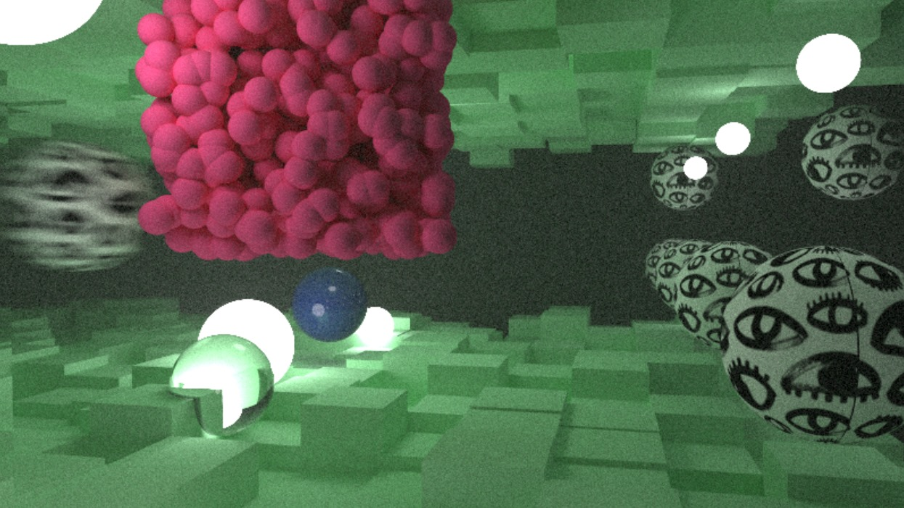
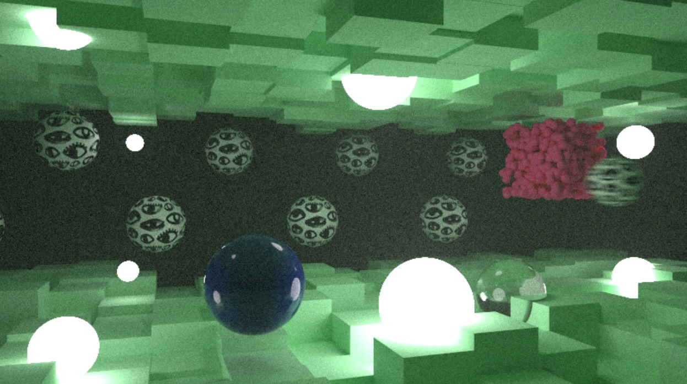
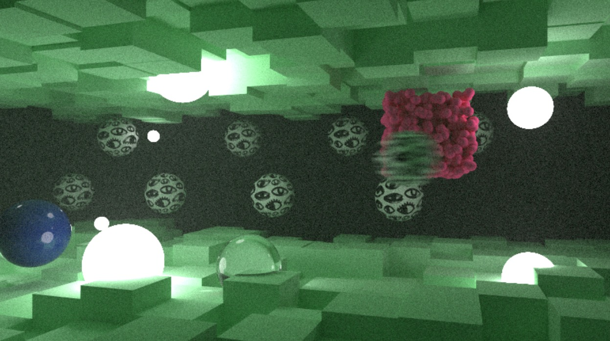
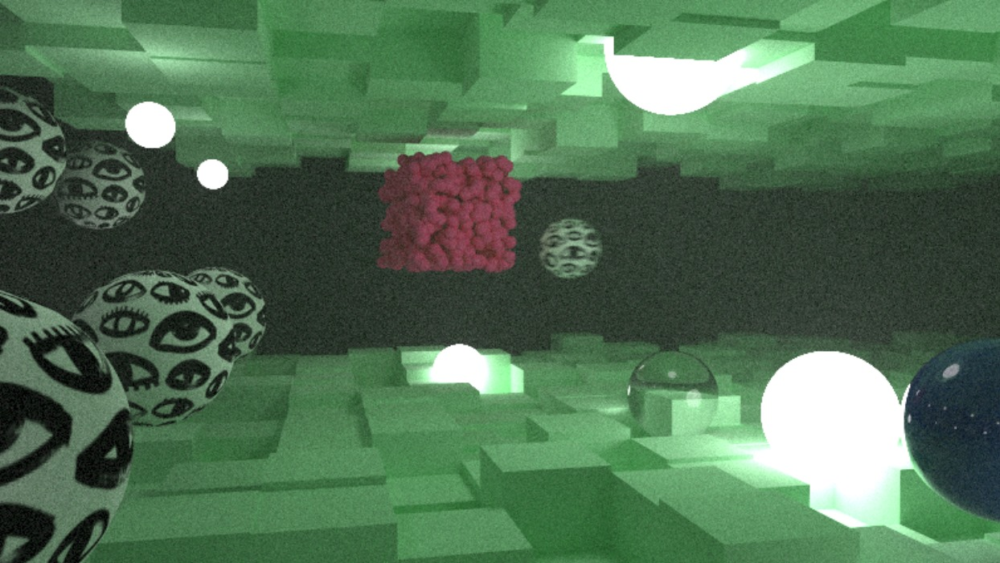

### Grupo
- Giulia Namie Azeka 
- Laura Rieko Marçal Imai
- Pedro Enrico Barchi Nogueira
- Pedro Henrique Alves de Araújo Silva

---

# PP2 - Projeto de Renderização de Cenas 3D

### Do Projeto 
O projeto utiliza um raytracing para gerenciamento de cenas tridimencionais realistas, que possuem iluminação e sombra. Nesse contexto, o código realiza a simulação de fenômenos físicos em cenas que incluem objetos como esferas, caixas e superfícies com textura. 

### Das Funcionalidades Principais
1. **Gerenciamento de Luz**: Implementação de luzes difusas para iluminar a cena, criando sombras suaves e realistas.
2. **Objetos de Cena**: Esferas, caixas e superfícies texturizadas são os principais objetos renderizados.
3. **Motion Blur**: Simula o efeito de desfoque de movimento em objetos que mudam de posição durante o tempo de exposição da câmera.
4. **Materiais Complexos**: Suporte para materiais como vidro, além de texturas de imagem aplicadas a objetos.
5. **Renderização de Cenas**: Utiliza estruturas de dados como Bounding Volume Hierarchies (BVH).
6. **Câmera Configurável**: A câmera permite configurar a proporção da imagem, profundidade de campo, ângulo de visão e foco.

### Como Compilar e Executar

Para a execução deste código é necessário ter instalado o CMake e executar em um sistema operacional Windows, seguindo os comandos no seu terminal:

Para debugar a build:

```cmake --build build --config release```

Para Realizar a chamada do programa e salvar o output em um arquivo image.ppm:

```build\Release\ExemploSimples.exe > image.ppm```

Note que como o programa deste repositório utiliza de texturar que são baixadas a partir de uma imagem externa, a imagem eye.png deve estar presente tanto na pasta build/release quanto na pasta geral, para que tanto o código quanto o executável tenham acesso a ela na hora de executar o programa.

A imagem utilizada se trata de uma versão gratuita de testes disponível em: 
https://www.shutterstock.com/pt/image-vector/brush-drawn-eyes-seamless-pattern-hand-2306922863

### Do Código
A principal diferença entre as cenas criadas se dá no fato de que a cena 1 apresenta um padrão de esferas de luz diferente das cenas 2-4, na cena 2-4 foram adicionadas pequenas esferas de luz intercaladas com as esferas texturizadas enquanto que na cena 1 as esferas de luz estão mais próximas da câmera. as diferenças entre as cenas 2~4 se dá somente na câmera.

``my_scene``: Função principal que configura a cena com caixas, esferas, e luzes.  

 <br>

``my_scene2``: Uma segunda cena com uma composição diferente de objetos, incluindo mais esferas de luz e objetos texturizados.  

 <br>

``my_scene3``: Uma terceira cena com uma visão diferente dos objetos. 

 <br>

``my_scene4``: Uma quarta cena com uma visão diferente dos objetos.   

 <br>

**Objetos**: São renderizados utilizando classes como ``sphere``, ``box``, ``quad``, que representam primitivos geométricos.  
**Materiais**: Incluem tipos como ``lambertian`` (difuso), ``metal`` e ``dielectric`` (transparente).  
**Câmera**: Configurações como campo de visão (FOV), posição da câmera, direção de visualização e efeitos de desfoque de movimento podem ser ajustadas na função ``camera``.

### Dos Parâmetros da Câmera
``aspect_ratio``: Proporção da imagem gerada.  
``image_width``: Largura da imagem gerada - pode ser alterada conforme necessidade.  
``samples_per_pixel``: Número de amostras por pixel para suavização da imagem.  
``max_depth``: Profundidade máxima para raios refletidos ou refratados.  

### Referências

Para a criação deste projeto foi utilizado comor referência os tutoriais disponibilizados por [_Ray Tracing in One Weekend_](https://raytracing.github.io/books/RayTracingInOneWeekend.html)

* Title (series): “Ray Tracing in One Weekend Series”

* Title (book): “Ray Tracing in One Weekend”

* Author: Peter Shirley, Trevor David Black, Steve Hollasch

* Version/Edition: v4.0.1

* Date: 2024-08-30

* URL (series): https://raytracing.github.io

* URL (book): https://raytracing.github.io/books/raytracinginoneweekend.html


## Projeto WebGL2 - Terra e Sol

### Descrição

Este projeto é uma simulação em WebGL2 que representa o Sol e a Terra em um ambiente 3D. Utilizando JavaScript, WebGL2 e shaders personalizados escritos em GLSL, o projeto cria esferas texturizadas que representam o Sol e a Terra, incluindo efeitos de iluminação e animação das órbitas.

### Como Executar

**Pré-requisito**: Ter um navegador que suporte WebGL2.

**Arquivos Necessários**: O projeto consiste dos seguintes arquivos:

- `index.html`
- `main.js`
- Pasta `textures` contendo as imagens `sun.jpg` e `earth.jpg`

**Execução**:

1. Abra o arquivo `index.html` em um navegador compatível.
2. O navegador irá renderizar a cena 3D mostrando o Sol e a Terra.

### Código

O código está dividido em dois arquivos principais:

#### `index.html`

Contém a estrutura básica da página e carrega os scripts necessários.

#### `main.js`

Contém a lógica principal da aplicação, incluindo a criação das esferas, carregamento das texturas, configuração dos shaders e a animação.

### Funcionalidades

- **Renderização 3D**: Utiliza WebGL2 para renderizar objetos 3D diretamente no navegador.
- **Animação**: A Terra orbita em torno do Sol, e ambos as esferas giram em torno de seus próprios eixos.
- **Iluminação**: Implementação de iluminação difusa e ambiente para realçar o realismo da cena.
- **Texturas**: Aplicação de texturas realistas da estrela e do planeta para representar fielmente a superfície do Sol e da Terra.

### Como o Código Funciona

- **Criação das Esferas**: A função `createSphere` gera a geometria das esferas com base nos parâmetros fornecidos.
- **Carregamento de Texturas**: A função `loadTexture` carrega imagens para serem usadas como texturas nas esferas.
- **Shaders Personalizados**: Shaders de vértice e fragmento são escritos em GLSL para manipular a posição dos vértices e aplicar iluminação.
- **Animação**: A função `render` atualiza continuamente a cena, recalculando as posições dos planetas com base no tempo.

### Dependências

- **WebGL2**: API JavaScript para renderização de gráficos 2D e 3D em um navegador web.
- **glMatrix**: Biblioteca para operações eficientes com matrizes e vetores.
- **Imagens de Textura**: Certifique-se de incluir as imagens `sun.jpg` e `earth.jpg` na pasta `textures`.

### Resultado

 <br>

### Referências
* Tuturiais Webgl: https://webgl2fundamentals.org/